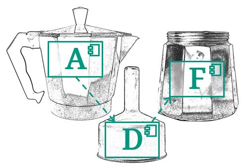

# Architecture Decomposition Framework

Softwarearchitekturen effektiv und effizient dokumentieren und modellieren
{: .fs-6 .fw-300}

**Architecture**: Es geht um **Software-Architektur**, also die Menge der Design-Entscheidungen, die über ein Software-System getroffen werden und das System als ganzes betreffen.

**Decomposition**: Um komplexe Strukturen zu verstehen, müssen wir diese zerlegen. Das ADF bietet hierfür einerseits eine **Architekturdokumentationsvorlage**, die schrittweise verschiedene Aspekte und Detailgrade eines Systems beleuchtet und dazu passende **Sichten**, mit denen man diese Aspekte als Diagramme modellieren kann.

**Framework**: Es geht nicht um die Modellierung konkreter Systeme, sondern um eine allgemeine Methodik, die für beliebige Software-Systeme angewendet werden kann (vom Kommandozeilen-Tool bis zu Microservices).

[Los geht's!](pages/about.html){: .btn .btn-primary }
[Beispiele](pages/documentation/examples.html){: .btn }
[Direkt zur Dokumentationsvorlage](pages/documentation/#verwendung-der-dokumentationsvorlage){: .btn }
