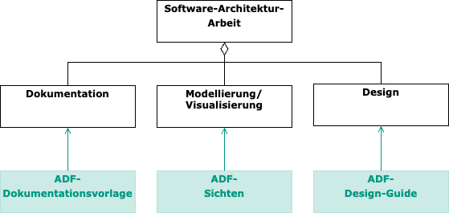

# Über das ADF

Architekturarbeit (*architecture work*) umfasst mehrere Aktivitäten wie z.B. **Dokumentieren** (Erstellen einer Architektur-Dokumentation), **Modellieren/Visualisieren** (mittels Diagrammen, die Sichten auf das System zeigen) und **Entwurf/Design** von Systemen (oder Teilen davon)[^1].

Diese Aktivitäten überlappen sich inhaltlich und zeitlich. So entstehen Architekturdiagramme (*Visualisierung*) häufig beim Architektur-Design und werden in die Architekturdokumentation aufgenommen. Auf dieser Seite wird beschrieben, wie das Architecture Decomposition Framework Architekturarbeit unterstützt.

- Die **ADF-Dokumentationsvorlage** liefert eine sinnvoll strukturierte Gliederung für eine Architekturdokumentation, welche die üblichen Architekturthemen abdeckt und mit einfachen Mitteln (Markdown im Text-Editor oder der IDE) leichtgewichtig bearbeitet werden kann [→ Bereich Dokumentation](documentation/).

- Die **ADF-Sichten** bieten eine Systemzerlegung anhand verschiedener Dimensionen und definieren dabei maßgeschneiderte Sichtentypen und passende Elemente, so dass dem/der Betrachter:in sofort klar ist, welcher Aspekt eines Systems hier beschrieben wird (ähnlich wie einem Architekten eines Hauses sofort klar ist, was er bei einem Grundriss zu erwarten hat), [→ Bereich Modellierung/Visualisierung](views/).

- Der **ADF-Design-Guide** liefert allgemeine Anhaltspunkte, wie man beim Architekturdesign vorgehen kann, [→ Design](/pages/design.html).

## Wer nutzt das ADF?

Das ADF wurde in vielen Industrie- und Forschungsprojekten aus verschiedenen Bereichen eingesetzt. Es stammt vom [Fraunhofer IESE Institut](https://www.iese.fraunhofer.de/) und wird an der [Fraunhofer Academy](https://www.academy.fraunhofer.de/de/weiterbildung/information-kommunikation/softwarearchitektur.html), der [HTWG Konstanz](https://www.htwg-konstanz.de/hochschule/fakultaeten/informatik/uebersicht/) und der [Hochschule Mannheim](https://www.informatik.hs-mannheim.de/) gelehrt.

[^1]: Eine weitere Aktivität ist das Architektur-Review, mehr dazu findet man z.B. im Buch [Pragmatic Evaluation of Software Architectures (J. Knodel, M. Naab)](https://doi.org/10.1007/978-3-319-34177-4)
