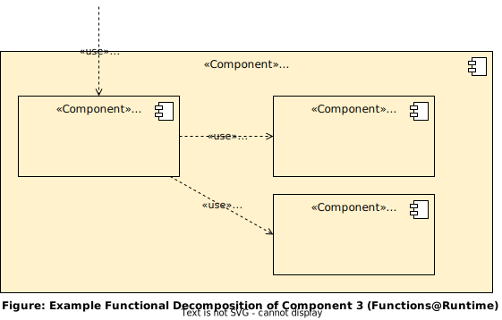
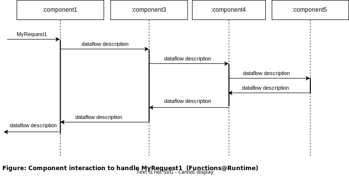
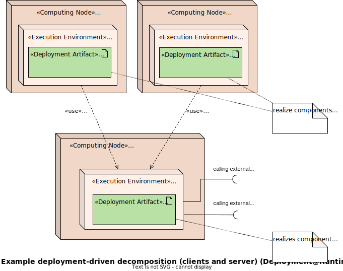
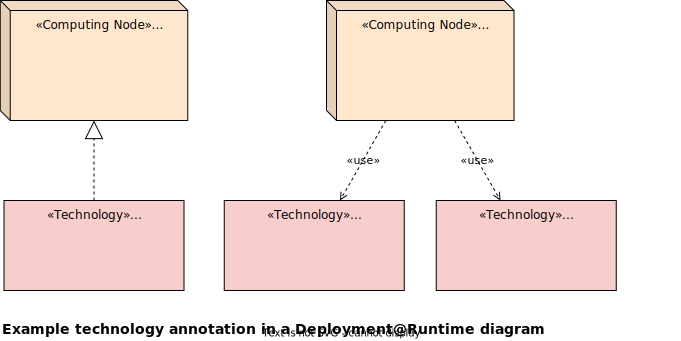
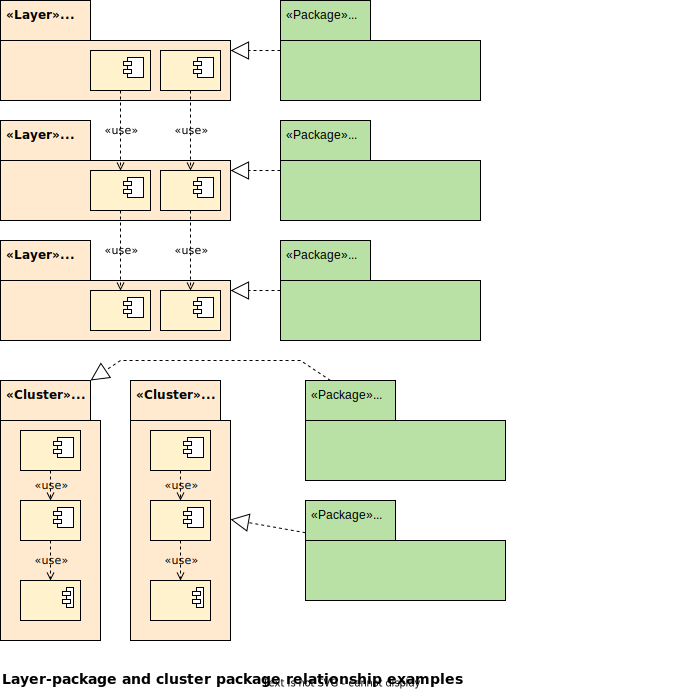

<!-- markdownlint-disable-next-line blanks-around-headings -->
# Architekturdesign mit dem Architecture Decomposition Framework (ADF) <!-- omit in toc -->
{: .no_toc }

Version 1.0.0

Dieser Artikel führt in das Thema Architektur-Design ein, gibt dazu allgemeine Ratschläge und erklärt den ADF-Architekturdesignprozess.

<!-- markdownlint-disable-next-line blanks-around-headings -->
## Inhalt <!-- omit in toc -->
{: .no_toc }

- TOC
{:toc}

## Einführung

Um ein System mit einer geeigneten Softwarearchitektur zu entwerfen, sind vor allem drei Dinge erforderlich:

1. Erfahrung
2. Erfahrung
3. Erfahrung

Und natürlich etwas Kreativität, um diese Erfahrung auf neue Situationen anzuwenden.

Während man gut lernen kann, wie man sein Architekturdesign verständlich dokumentiert (z.B. durch die Verwendung des ADF und der [ADF-Dokumentationsvorlage](https://github.com/architecture-decomposition-framework/adf-documentation-template)), braucht man zum Sammeln von Erfahrung mit Softwaresystem meist deutlich länger. Man muss an einer Vielzahl unterschiedlicher Systeme arbeiten, um ein erfahrener Softwarearchitekt zu werden. Darüber hinaus können sich Softwaresysteme stark unterscheiden. Eine Softwarearchitektur, die für ein System geeignet ist, kann für ein anderes System völlig ungeeignet sein.

Daher werden wir in diesem Dokument keine konkreten Ratschläge geben. Wir werden keine Aussagen treffen wie: "Microservices sind derzeit das beste Architekturpattern", "TypeScript ist die beste Technologie für die Client-Entwicklung" oder "Das Hauptsystem sollte immer aus zwei oder drei Teilsystemen bestehen".

Wir wissen jedoch aus der Praxis, dass in vielen Softwareentwicklungsprojekten die Rolle des Softwarearchitekten:in nicht explizit zugewiesen wird. Oft ist es die Aufgabe des leitenden Entwicklers/der leitenden Enwicklerin, Entscheidungen über die Softwarearchitektur zu treffen. Die meisten dieser Entscheidungen sind implizit und undokumentiert (d.h. außer durch den Quellcode des Projekts).

In diesem Dokument beschreiben wir einen generischen Architekturdesignprozess, der sowohl

1. *Softwareentwickler:innen und unerfahrene Architekt:innen* anspricht, die nicht wissen, wie sie mit der Softwarearchitektur beginnen sollen, indem wir Ideen bieten, wie man das System als Ganzes betrachtet und es in handhabbare Teile zerlegt, *bevor* man mit dem Coden beginnt, als auch
2. *erfahrene Softwarearchitekt:innen*, um ihnen eine bessere Strategie zur Gestaltung eines Systems zu zeigen, bei der sie immer die gewünschten Qualitätsattribute im Auge behalten können.

## Überblick über den Architekturdesignprozess

Architekturdesign erfordert viele verschiedene Aktivitäten. Unser Designprozess benennt diese Aktivitäten und schlägt eine Reihenfolge vor, die hilft, sich auf das Endergebnis zu konzentrieren - ein adäquates (laufendes) System, das alle Anforderungen und Qualitätsattribute (d.h. die Architekturtreiber) erfüllt. Dies ist der vollständige Prozess visualisiert:

Mit Treibern sind dabei alle Architektur-relevanten Anforderungen gemeint. Diese können Kernfunktionen, Qualitätsattribute (zur Lauf- und Entwicklungszeit), Geschäftziele und Randbedingungen umfassen.

In den folgenden Abschnitten werden wir die verschiedenen Aktivitäten (blaue Kästchen in der Mitte der Abbildung) genauer erklären. Die kreisförmigen Pfeile auf der linken Seite deuten an, dass die Aktivitäten in den meisten Fällen nicht genau einmal linear durchschritten werden, sondern viele Iterationen und Subiterationen möglich (und nötig) sind, um ein adäquates System zu erhalten.

Die linke Seite (in Rot) zeigt, was als Eingabe für jeden Schritt betrachtet werden sollte, während die rechte Seite das entsprechende Architekturdokumentationsartefakt darstellt, das in jedem Schritt erstellt oder aktualisiert wird. Diese Artefakte müssen konsistent sein ("Konsolidieren"). Schließlich sollte jedes neue Designinkrement im System realisierbar sein, was z.B. mit Hilfe von Prototypen getestet werden kann ("Vertrauen erhöhen").

## Runtime first! (Laufzeit zuerst)

Während man als Entwickler:in nach einem ersten Verständnis der Ideen (Anforderungen) gerne direkt mit dem Coden loslegen möchte, sollten ein:e Softwarearchitekt:in zuerst das große Ganze verstehen, einschließlich der wichtigsten Anforderungen und Qualitätsattribute des Systems. Zu diesem Zweck ist es viel hilfreicher, sich das System bereits existierend vorzustellen und dann die Technologien, Entwicklungstools und Code-Struktur entsprechend passend auszuwählen, als umgekehrt. Daher behandeln die folgenden Kapitel zuerst das System zur Laufzeit.

## System-Kontext-Abgrenzung

Wir beginnen damit, die Rollen der Benutzer:innen zu identifizieren, die mit dem System interagieren, und den Umfang des zu entwickelnden Systems festzulegen (das kann ein System oder mehrere Systeme sein, in einer Black-Box-Ansicht). Dann spezifizieren wir, wie die Rollen mit dem System interagieren: Was wollen sie erreichen?

Zusätzlich identifizieren wir alle externen Systeme, die in irgendeiner Form mit dem zu entwerfenden System interagieren. Wofür werden die System benötigt? Gibt es eine Verbindung vom externen System mit zu dem zu entwickelnden System oder umgekehrt? Oder beides?

Das Ergebnis der Kontextabgrenzung kann mit Elementen der [Software@Runtime-Palette](../views/elements/index.html#softwareruntime) dargestellt werden und gehört zur Dimension [Function@Runtime](../views/dimensions/index.html#functionsruntime).

Dies ist ein unspezifisches Beispiel dafür, wie ein solches Diagramm aussehen kann. Natürlich hängt die tatsächliche Anzahl der Elemente und die Art und Weise, wie die Elemente verbunden sind, stark vom tatsächlichen System ab.

## System-Zerlegung

In diesem Teil des Artikels beschreiben wir, wie man ein System in kleinere, handhabbare Teile zerlegt. Die verschiedenen Zerlegungsstrategien haben keine bestimmte Reihenfolge und können sogar zu inkompatiblen Architekturstrukturen führen, wenn sie unabhängig voneinander ausgeführt werden. Wir benötigen also möglicherweise nicht alle. Wenn wir jedoch nicht von Anfang an schon wissen, dass unsere Architektur von einem bestimmten Aspekt (z.B. von Daten) getrieben werden soll, probieren wir möglichst viele verschiedene Zerlegungsstrategien aus und entscheiden uns für die am besten geeignete oder kombinieren Ideen aus allen.

### Hierarchische funktionale Zerlegung

Normalerweise muss ein System verschiedene Funktionalitäten bereitstellen, z.B. einen Kunden authentifizieren, Artikel zum Kauf anzeigen, Artikel in einen Warenkorb legen, Zahlungen vornehmen und so weiter.

Diese Zerlegungsstrategie teilt das System in kleinere, funktionale Teile auf. Wenn wir mehr als ein System entwerfen, tun wir dies für jedes System.

Das Ergebnis der Kontextabgrenzung kann mit Elementen der [Software@Runtime-Palette](../views/elements/index.html#softwareruntime) dargestellt werden und gehört zur Dimension [Function@Runtime](../views/dimensions/index.html#functionsruntime).

Dies ist ein unspezifisches Beispiel dafür, wie ein solches Diagramm aussehen kann. Natürlich hängt die tatsächliche Anzahl der Elemente und die Art und Weise, wie die Elemente verbunden sind, stark vom tatsächlichen System ab.

Oft ist die funktionale Zerlegung hierarchisch, wobei Komponenten rekursiv in Unterkomponenten und sogar Unter-Unterkomponenten unterteilt werden, z.B.

- das System ist unterteilt in
  - Komponente 1, die unterteilt ist in
    - Komponente 1a und
    - Komponente 1b
  - Komponente 2, die unterteilt ist in
    - Komponente 2a,
    - Komponente 2b,
    - Komponente 2c, die unterteilt ist in
      - Komponente 2c1 und
      - Komponente 2c2
    - Komponente 2d, die unterteilt ist in
  - Komponente 3, die unterteilt ist in
    - Komponente 3a,
    - Komponente 3b und
    - Komponente 3c,
  - ...

Dies kann durch Diagramme dokumentiert werden, die eine detaillierte Zerlegung bestimmter Komponenten wie dieses (unspezifische) Beispiel zeigen:

Dies ist viel übersichtlicher, als alle Komponenten und Unterkomponenten in einem einzigen Diagramm darzustellen.

### Datengetriebene Zerlegung

Software-Ingenieur:innen sind darin geschult, ausgeklügelte Datenmodelle zu entwickeln und sie in UML-Klassendiagrammen oder SQL-Tabellenbeschreibungen auszudrücken. Während diese Modelle während der Entwicklung entscheidend sind, empfehlen wir, zunächst einen Schritt zurückzutreten und das gesamte System zur **Laufzeit** zu betrachten: Welche verschiedenen Daten gibt es im System? Können verschiedene Domänen identifiziert werden? Ein Webshop hat beispielsweise Benutzerdaten, Artikeldaten, Warenkorbdaten und Zahlungsdaten. Sobald die wichtigsten Datenentitäten identifiziert sind, können sie weiter verfeinert werden, z.B. durch Aufteilung oder Hinzufügen von Attributen. Beachten Sie, dass es in diesem ersten Schritt nicht um Vererbung oder Datentypen geht, sondern um die allgemeine Struktur der Daten.

Das Ergebnis der datengetriebenen Zerlegung kann mit Elementen der [Software@Runtime-Palette](../views/elements/index.html#softwareruntime) dargestellt werden und gehört zur Dimension [Data@Runtime](../views/dimensions/index.html#dataruntime).

Dies ist ein unspezifisches Beispiel dafür, wie ein Diagramm mit den wichtigsten Datenentitäten aussehen kann. Natürlich hängen die tatsächlichen Entitäten stark vom tatsächlichen System ab.

An dieser Stelle gilt es festzustellen, dass Datengetriebene Zerlegung großen Einfluss auf die funktionale Zerlegung haben kann. Daten existieren normalerweise nicht für sich alleine, sondern werden erstellt und durch das System geschickt. Daher ist es sinnvoll, funktionale und Datenansichten zu verbinden, z.B. indem man den Datenfluss zwischen Komponenten angibt. Ein gängiger Ansatz im modernen Softwaredesign ist das sogenannte Domain Driven Design, bei dem die verschiedenen Domänen (und ihre Datenmodelle) die Struktur des gesamten Systems bestimmen. [Welcome to DDD](https://github.com/ddd-crew/welcome-to-ddd) von der DDD-Crew ist ein guter Ausgangspunkt, um mehr zu erfahren.

### Dynamische Systembeschreibung

Je komplexer die Komponentenstruktur eines Systems ist, desto weniger offensichtlich scheint es, wie, in welcher Weise und insbesondere in welcher Reihenfolge die Komponenten miteinander interagieren. Es gibt verschiedene Möglichkeiten, diese Aspekte zu beschreiben; vorausgesetzt natürlich, dass wir bereits einige Komponenten identifiziert und spezifiziert haben.

Eine einfache Möglichkeit ist das fortlaufende Nummerieren der Beziehungen zwischen Komponenten und eine Beschreibung, was in jedem Schritt passiert. Hier ist ein unspezifisches Beispiel dafür, wie das aussehen kann:

Diese Darstellung kann jedoch leicht unübersichtlich werden, wenn kompliziertere Fälle oder optionale Pfade beschrieben werden sollen. In diesem Fall eignen sich [UML-Sequenzdiagramme](https://de.wikipedia.org/wiki/Sequenzdiagramm) besser (gleiches Beispiel noch mal als Sequenzdiagramm):

Das [ADF-Sichten-Framework](../views/) führt keine besondere Notation für Sequenzdiagramme ein - wir verwenden einfach diejenige, mit der wir am besten vertraut sind (im Zweifel einfach UML).

### Deployment-getriebene Zerlegung

Um das Thema Deployment (Bereitstellung) zu behandeln, betrachten wir, wie die verschiedenen Funktionalitäten des Systems zur Ausführung gebracht werden. Viele verschiedene Deployment-Arten sind vorstellbar: (Desktop-)Client-Deployment, Server-Deployment, Zweischicht- oder Mehrschicht-Client-Server-Topologien, Peer-to-Peer-Netzwerke, monolithische Backends, Microservices, Bare-Metal- oder virtualisierte Server, containerisiertes Deployment und viele mehr. Verschiedene Deployment-Methoden bestimmen auch die Art der Kommunikation zwischen Komponenten: Methodenaufrufe, HTTP-Anfragen, Event- oder Message-Busse - um nur einige zu nennen.

Wenn unsere Software Teil einer bereits bestehenden Software oder eines Systems ist, z.B. ein Plugin einer Desktop-Software oder ein weiterer Dienst für einen Enterprise-Service-Bus, ist es sinnvoll, zuerst die bestehende Systemlandschaft zu visualisieren und zu verstehen sowie sich zu überlegen, wie die eigene Komponenten/das eigene System in diese Landschaft integriert (deployt) wird, bevor man die eigene Komponente weiter in Bezug auf Funktionen und Daten zerlegt.

In den meisten Fällen haben wir jedoch bereits verschiedene Komponenten und deren Interaktion (funktionale Zerlegung) identifiziert, wenn wir beginnen, unser System Deployment-getrieben zu zerlegen. In diesem Fall müssen wir die funktionalen Teile des Systems auf eine oder mehrere Ausführungsumgebungen oder Computing Nodes ("Rechenknoten") verteilen. Es ist nicht ungewöhnlich, dass eine Deployment-getriebene Zerlegung eine weitere funktionale Zerlegung (z.B. client- und serverseitige Funktionalität) oder eine datengetriebene Zerlegung (z.B. Request-/Response-Modell oder ein Event-Modell) auslöst.

Das Ergebnis der Deployment-getriebenen Zerlegung kann mit Elementen der [Environment@Runtime-Palette](../views/elements/index.html#environmentruntime) dargestellt werden und gehört zur Dimension [Deployment@Runtime](../views/dimensions/index.html#deploymentruntime).

Dies ist ein (immer noch ziemlich unspezifisches) Beispiel dafür, wie ein Deployment-Diagramm aussehen kann, wenn Client-Server-Architektur und zwei verschiedene Client-Apps verwendet werden. Aufgrund der zuvor erwähnten immensen Vielfalt an verschiedenen Deployment-Arten können Inhalt und Topologie von Bereitstellungsdiagrammen stark variieren.

### Auswahl der Technologien zur Laufzeit

Blicken Köch:innen auf ihre verfügbaren Töpfe, Pfannen und Messer, um zu planen, was auf der nächsten Speisekarte stehen soll? Eher nicht. Ebenso empfehlen wir, keine voreiligen Technologieentscheidungen zu treffen, bevor das tatsächliche System und seine beabsichtigte Architektur verstanden sind. Allerdings sind völlig technologie-agnostische Architekturen kaum vorteilhaft. Daher sollten wir immer versuchen, Technologieentscheidungen zu treffen, die adäquat sind, um das Problem/die Anforderungen zu lösen (nicht umgekehrt), und diese Entscheidungen explizit machen sowie die Gründe angeben, die zu den Entscheidungen geführt haben.

Technologieentscheidungen, welche die Laufzeit betreffen, gehören zur Dimension [Technologies@Runtime](../views/dimensions/index.html#technologiesruntime). Sie können als eigene Ansicht modelliert oder in bestehende Ansichten integriert werden. Wir können dazu das Technologieelement verwenden, das in allen [Elementpaletten](../views/elements/) verfügbar ist.

In diesem Beispiel werden zwei verschiedene Möglichkeiten zur Annotation von Technologien demonstriert: Die UML-Implementierungsbeziehung (linke Seite) und die Nutzungsbeziehung (rechte Seite). Das Technologieelement können wir in jedem Diagrammtyp verwenden.

Aufgepasst: Wir sind immer noch dabei, unser (beabsichtigtes) System **zur Laufzeit** zu beschreiben. Technologieentscheidungen für die Entwicklung werden später in eigenen dedizierten Ansichten getroffen und dokumentiert.

## Qualitätsattribute zur Laufzeit

Nachdem wir diesen Schritt erreicht haben, sollten wir nun eine gute Vorstellung davon haben,

- wie das System die Hauptfunktionalität abbildet (Komponenten, Teilsysteme usw.),
- welche Daten vom System verwaltet werden und
- wie das System bereitgestellt wird.

Dabei haben wir möglicherweise bereits Technologieentscheidungen getroffenen und dokumentiert.

Jetzt ist es an der Zeit, die Qualitätsanforderungen des Systems zu überprüfen. Das Erreichen bestimmter Qualitätsziele kann zu einer Transformation des bisher modellierten Systems führen. Dabei kann es notwendig sein, neue Komponenten oder zusätzliche Schichten einzuführen, bestimmte Komponenten neu zu strukturieren, während der Bereitstellung zu skalieren oder andere Technologien auszuwählen - um nur einige Beispiele zu nennen. Dieser Prozess ist stark abhängig vom tatsächlichen System und seinen Qualitätsanforderungen. Er führt oft zu einer Wiederholung einiger der vorherigen Zerlegungsschritte.

Nehmen wir ein konkretes Beispiel für eine qualitätsgetriebene Transformation des Systems: Wir stellen uns vor, dass wir unser System als Client und Server entworfen haben, wobei der Server eine Linux-Maschine mit einem REST-Backend ist. Jetzt wählen wir einen Verfügbarkeits-Treiber - eine Qualitätsanforderung, die verlangt, dass 99 von 100 Anfragen nicht fehlschlagen dürfen. Um diesen Treiber zu realisieren, entscheiden wir uns, das Deployment zu ändern und zwei Linux-Maschinen mit dem Backend darauf plus einen Loadbalancer bereitzustellen, der fehlerhafte Server neu startet und Anfragen an eine noch verfügbare Serverinstanz weiterleitet. Dies ist eine Transformation der bereits bestehenden Deployment-getriebenen Zerlegung unter dem Aspekt der Verfügbarkeit. Natürlich gibt es andere Möglichkeiten, hohe Verfügbarkeit zu erreichen - dies ist nur ein Beispiel.

## Abbildung der Laufzeit auf die Entwicklungszeit und Entwicklungszeit-Zerlegung

Wir haben nun ein tiefes Verständnis dafür gewonnen, wie unser System zur Laufzeit zusammengesetzt ist. Als nächster Schritt müssen wir unsere Entwicklungsinfrastruktur und unseren Code-Basis einrichten, der letztendlich unser System produzieren wird.

### Abbildung der Laufzeit auf die Entwicklungszeit

Eine wichtige Aktivität besteht darin, Komponenten (zur Laufzeit) ihren realisierenden Modulen (zur Entwicklungszeit) zuzuordnen. Im Allgemeinen sind alle Arten von Beziehungen möglich, wie die folgende Abbildung zeigt.

Die gelben Elemente stammen dabei aus der [Software@Runtime-Palette](../views/elements/index.html#softwareruntime), während die grünen Elemente aus der [Software@Devtime-Palette](../views/elements/index.html#softwaredevtime) stammen. Dies ist eine der wenigen Arten von Ansichten, bei denen die Verwendung von sowohl Laufzeit- als auch Entwicklungselementen erwünscht ist.

Wenn wir einem objektorientierten Programmierparadigma folgen, werden Module normalerweise durch Klassen realisiert. Oft werden 1:1-Beziehungen hergestellt. In diesem Fall müssen wir keine explizite Ansicht erstellen, die die Zuordnung veranschaulicht, vorausgesetzt, es wird eine konsistente Benennung verwendet. In vielen Situationen lohnt es sich jedoch, Komponenten-Modul-Beziehungen explizit zu machen, z.B. wenn eine Klasse, die eine Komponente realisiert, von einer anderen Klasse erbt (1:2), wenn eine Komponente mit zusätzlichen Klassen aus einem Framework realisiert wird oder wenn ein Modul mehrere verschiedene Komponenten realisiert.

Eine Diagramm zum Aspeket "Abbildung der Laufzeit auf die Entwicklungszeit" kann auch beschreiben, welche Teile des Quellcodes (z.B. welches Paket) welchen Teil des laufenden Systems realisieren. Es kann sein, dass Code in einem bestimmten Paket eine bestimmte Schicht implementiert, z.B. die UI-Schicht (horizontale Zerlegung) oder ein bestimmtes Cluster, das sich mit einem bestimmten Teil der Domänendaten befasst, z.B. Benutzerdaten (vertikale Zerlegung).

Diese Abbildungen können bei komplexeren Komponentenstrukturen, der Kombination von Schichten und Clustern und der Verwendung von Unterpaketen umfangreicher werden.

Auch wenn es naheliegend ist, all diese Entwicklungszeitinformationen in bestehende Laufzeitsichten zu integrieren, erstellen wir lieber zusätzlich explizite Laufzeit-zu-Entwicklungszeit-Sichten, um bestehende Sichten nicht zu überladen. 

### Zerlegung auf Entwicklungszeit-Ebene

Während des Prozesses der Zuordnung von Laufzeit zu Entwicklungszeit benötigen wir normalerweise mehrere Iterationen, um unsere Entwicklungszeitstrukturen sukzessive zu verfeinern. Dies ist eine weitere Zerlegung des Systems, aber jetzt für den Entwicklungszeitteil. Die Zerlegung kann auf verschiedenen Ebenen erfolgen. Hier sind einige Beispiele:

- Erstellen verschiedener Quellcode-Repositories für verschiedene Teile des Systems (z.B. Backend, Client-Apps, gemeinsame Bibliotheken) und Entwickeln eines Versionierungsmechanismus - oder vielleicht die Verwendung eines Monorepos für den gesamten Code, aber dann Definieren einer wartbaren, einheitlichen Struktur innerhalb dieses Repos,
- Extrahieren von wiederverwendbarem Code aus Modulen, indem er in gemeinsame Superklassen (Vererbung) oder flexibel zusammensetzbare Funktionen (Komposition) eingefügt wird,
- Erstellen eines Datenmodells, das geeignet ist, in einer Datenbank gespeichert zu werden, indem Datentypen spezifiziert und Beziehungen zwischen Entitäten modelliert werden (selbst wenn nicht-relationale Datenmodelle verwendet werden, sind einige Entitäten durch eine gemeinsame ID verbunden),
- Einrichten von Build-Prozessen und Bereitstellung für die verschiedenen Teile des Systems.

Entwicklungszeit-Zerlegungsentscheidungen gehören zu den Dimensionen [Software@Devtime](../views/dimensions/index.html#softwaredevtime) und [Environment@Devtime](../views/dimensions/index.html#environmentdevtime) und können mit der [Software@Devtime-Palette](../views/elements/index.html#softwaredevtime) und der [Environment@Devtime-Palette](../views/elements/index.html#environmentdevtime) modelliert werden.

Stellen Sie sicher, dass Sie auch alle Technologieentscheidungen für das System zur Entwicklungszeit (und deren Begründungen) dokumentieren: Programmiersprache(n), Frameworks, Bibliotheken, IDEs, Build-Server, Code-Checker, ... Dies kann ähnlich wie im Abschnitt [Auswahl der Laufzeittechnologie](#auswahl-der-technologien-zur-laufzeit) beschrieben werden.

## Qualitätsattribute zur Entwicklungszeit

Anforderungsdokumente enthalten selten viele Informationen zu Qualitätsattributen zur Entwicklungszeit wie z.B. Testbarkeit, Erweiterbarkeit, Anpassungsfähigkeit und Wartbarkeit. Dennoch haben diese Qualitäten einen großen Einfluss auf die Korrektheit, Zuverlässigkeit und Portabilität des Systems. Darüber hinaus reduziert eine gut vorbereitete CI/CD-Pipeline die Markteinführungszeit neuer Funktionen drastisch.

Daher ist es entscheidend, kontinuierlich auf Qualitätsattribute zur Entwicklungszeit zu achten und, wenn sie nicht von Anfang an erfüllt sind, den Entwicklungszeitstruktur des Systems zu transformieren, um diese Qualitätsattribute zu erfüllen. Dies kann bedeuten, eine einheitliche Codeorganisation über mehrere Module und Pakete hinweg zu etablieren, Service-Schnittstellen für bessere automatisierte Modultests zu extrahieren, Code-Smells zu reduzieren, automatisierte Builds einzuführen und vieles mehr.

## Zusammenfassung

Architekturdesign ist ein Prozess mit vielen Aktivitäten:

Je mehr Erfahrung wir haben, desto einfacher ist es für uns, verschiedene Lösungsideen zu entwickeln und die am besten passende zu finden. Wenn wir weniger erfahren sind oder unser Hintergrund hauptsächlich in der Softwareentwicklung liegt, versuchen wir, die ersten drei Aktivitäten nicht zu überspringen, sondern

1. den Systemkontext abzugrenzen,
2. das **System zur Laufzeit** in handhabbare Teile zu zerlegen und
3. Qualitätsattribute anzuwenden,

bevor wir mit der Entwicklung beginnen.

Wir empfehlen, die Ergebnisse jedes Designschritts in einer Architekturdokumentation zu dokumentieren, z.B. der [ADF-Dokumentationsvorlage](../documentation/). Dort ist Platz dafür vorgesehen, um die Systemzerlegung sowie Lösungskonzepte zur Erfüllung der Qualitätsanforderungen zu beschreiben.
