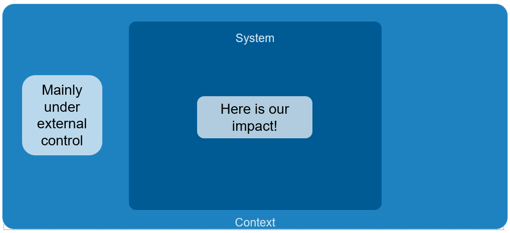
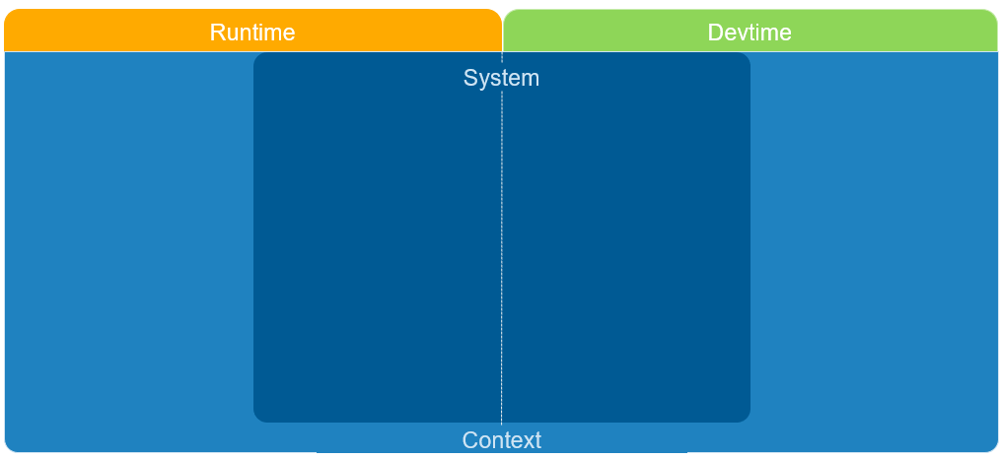
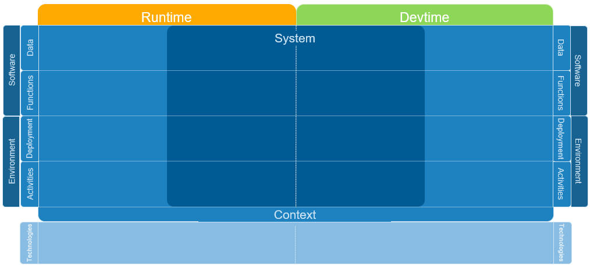
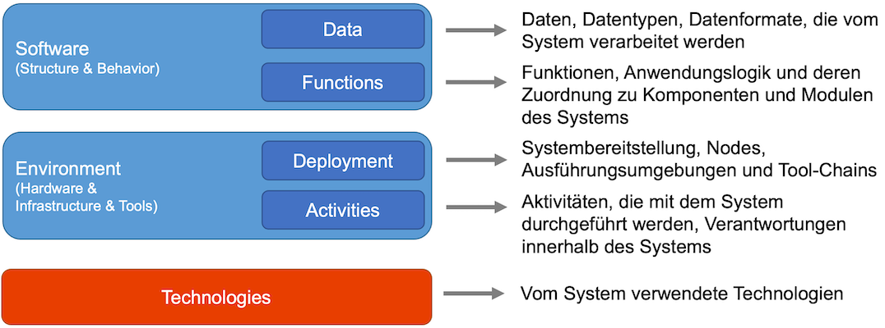
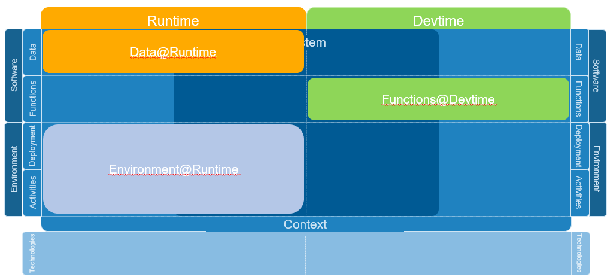

<!-- markdownlint-disable-next-line blanks-around-headings -->
# Dimensionen und Sichtentypen des Architecture Decomposition Framework<!-- omit in toc -->
{: .no_toc }

<!-- markdownlint-disable-next-line blanks-around-headings -->
## Einführung
{: .no_toc }

Gerade am Anfang der Entwicklung ist es verlockend, ein Software-System mit all seinen Details in einem großen Diagramm zu beschreiben. Die meisten Systeme sind aber zu komplex (oder werden dies mit der Zeit), so dass man schnell den Überblick verliert. Ein viel praktikablerer Ansatz ist es daher, ein System mit mehreren, unterschiedlichen Sichten (Perspektiven, Blickwinkeln) zu beschreiben.

Wie der Name *Decomposition* Framework schon andeutet, ist der Kern des Frameworks genau diese Zerlegung. Es gibt dafür drei verschiedene Kriterien, die wir verwenden, um ein System in handhabbare Teile zu zerlegen. Wir nennen diese Kriterien *Dimensionen*:

- Dimension 1: *System* versus *Kontext*
- Dimension 2: *Runtime* versus *Devtime* (Entwicklungszeit)
- Dimension 3: *Daten*, *Funktionen*, *Bereitstellung*, *Aktivitäten*, *Technologien*

In den folgenden Abschnitten werden diese ausführlicher erklärt. Da dieses Dokument eher abstrakt und allgemein ist, kann es hilfreich sein, sich einige Beispiele für Architektursichten mit dem ADF anzusehen, wie etwa die Abbildungen in [dieser Dokumentation](https://github.com/neshanjo/what2eat/blob/with-cache/doc/architecture-documentation.md) oder die Bilder am Ende von [diesem Artikel](https://www.iese.fraunhofer.de/blog/softwarearchitekturen-einfacher-designen-und-verstaendlicher-dokumentieren-mit-dem-fraunhofer-adf/).

<!-- markdownlint-disable-next-line blanks-around-headings -->
## Inhalt <!-- omit in toc -->
{: .no_toc }

- TOC
{:toc}

## System versus Kontext

Ein System ist immer in einen Kontext eingebettet, und wir müssen diesen Kontext bei der Gestaltung berücksichtigen: Es gibt die Benutzer des Systems und es gibt andere (externe) Systeme, die mit unserem System interagieren.

Der Prozess der Trennung von System und Kontext ist als *System-Kontext-Abgrenzung* bekannt.

Eine einfache Faustregel, die hilft zu entscheiden, was zu welchem "Seite" des Systems gehört, ist, ob wir die Kontrolle über das System oder den Systemteil haben, d.h. ob wir sein Design, z.B. seine API, kontrollieren können oder ob wir das System als gegeben hinnehmen müssen.

## Runtime versus Devtime

Wenn wir ein System oder Teile davon visualisieren wollen, müssen wir uns immer fragen, ob wir das laufende System (*Runtime*) oder das System zur Entwicklungszeit (*Devtime*) visualisieren.

So entscheidend diese Unterscheidung auch erscheinen mag: Diagramme vermischen oft diese Aspekte, was in der Praxis oft zu Mehrdeutigkeiten und Missverständnissen führt.

Gibt es überhaupt einen Unterschied? Nicht immer. Beispielsweise kann es genau eine Instanz der UserLogin-Komponente geben, die durch ein einziges UserLogin-Modul realisiert wird, welches eine Quelldatei mit der entsprechenden Implementierung enthält.

Häufig gibt es jedoch Unterschiede: Ein Microservice wird zur Laufzeit mehrfach instanziiert (mehrere Boxen), während er in einer einzigen Codebasis (ein Paket) entwickelt wird. Oder die UserLogin-Komponente zur Laufzeit besteht aus den Modulen UserLoginService, AbstractLoginService und zusätzlichen Drittanbieter-Bibliotheken zur Behandlung von OAuth2 zur Entwicklungszeit.

Daher beschreiben wir in Laufzeitansichten das System, wie es während der Ausführung funktioniert (System in Aktion). Als Elemente verwenden wir Komponenten, Schichten, Cluster/Vertikalen, Daten, Schnittstellen oder Connectors, also logische Elemente, die ein laufendes System strukturieren und die Interaktion beschreiben. Im Design beginnen wir normalerweise auch mit solchen Ansichten, weil es sehr hilfreich ist, zuerst darüber nachzudenken, wie das System funktionieren soll, wenn es läuft, weil es dafür gebaut wird und dort die meisten Qualitätsattribute erfüllt werden müssen.

Im Gegensatz dazu denken wir bei Entwicklungszeitsichten darüber nach, wie wir das System realisieren wollen (System in Entwicklung, Entwicklungsteam in Aktion). Hier arbeiten wir hauptsächlich mit Modulen, Paketen, Datentypen, Schnittstellen oder Bibliotheken, also logischen Elementen, die entwickelt werden müssen und deren Code und Abhängigkeiten organisiert werden müssen.

Falls wir bereits eigene Architekturansichten erstellt haben, unabhängig vom verwendeten Sichten-Framework oder den Elementtypen, sollten wir prüfen, ob unser Diagramm Laufzeit- und Entwicklungsaspekte vermischt. Es kann oft sinnvoll und vorteilhaft sein, das Diagramm in zwei separate Darstellungen zu unterteilen.

## Daten, Funktionen, Bereitstellung, Aktivitäten, Technologien

Schließlich legen wir verschiedene Aspekte von Systemen über die vorherigen Dimensionen des ADF: Daten, Funktionen, Deployment (Bereitstellung), Aktivitäten und Technologien. Dies vervollständigt unser Framework, wie die folgende Abbildung zeigt:

Die folgende Abbildung gibt einen groben Überblick darüber, wofür die einzelnen Dimensionen stehen:

### Terminologie

Mit dem Schema "Data/Functions/Deployment/Activities/Technologies"@"Runtime/Devtime" können wir eindeutig angeben, welchen Aspekt des Systems wir beschreiben. Wir verwenden hier die englischen Bezeichnungen, wie sie in der bisherigen, englischsprachigen Literatur zum ADF üblich sind. Dies erleichtert zudem eine Übertragbarkeit der Sichten in andere Sprachen.

Daher beschreibt ein Diagramm mit dem Typ "Data@Runtime" Aspekte, wie Daten zur Laufzeit aussehen und wie viele Objekte es gibt.

Gemischte Typen wie Funktionen+Bereitstellung@Runtime sind ebenfalls möglich. Sogar Functions@Runtime+Devtime könnte in bestimmten (seltenen) Fällen angemessen sein, in denen wir ausdrücklich Laufzeit- und Entwicklungsaspekte mischen wollen.

Wir empfehlen, den Typ jedes Diagramms an den Diagramm-Titel anzuhängen, wie

- "System-Kontext-Abgrenzung (Funktions@Runtime)",
- "Die wichtigsten Services (Funktions@Runtime)",
- "Vererbungshierarchie der Service-Klassen (Data@Devtime)", oder
- "Deployment-Prozess des Staging-Servers (Deployment+Activity@Devtime)".

Auf diese Weise können alle, die mit dem ADF vertraut sind, schneller einordnen, welcher Aspekt des Systems beschrieben wird.

Wenn wir bereits selbst Architektursichten erstellt haben (egal welches Sichten-Framework oder welche Elementtypen wir verwendet haben), versuchen wir, sie mit der obigen Terminologie zu klassifizieren.

### Typische Anliegen der verschiedenen Sichtentypen

Es gibt typische Fragen, mit denen sich jeder Sichtentyp normalerweise beschäftigt. Wir listen sie in den folgenden Unterabschnitten auf.

#### Data@Runtime

- Welche Ist-Daten werden zur Laufzeit verwendet?
  - z.B. Daten über einen Nutzer, Daten über eine Lieferung
- Welche Objekte werden erstellt? Wie viele?

#### Data@Devtime

- Wie werden Datenstrukturen definiert?
- Welche Klassen, Schnittstellen, Enums gibt es?
- Wie hängen sie zusammen (z. B. Vererbung, Assoziation)?
- Welche Datenformate werden benötigt?

#### Functions@Runtime

- Was tut das System und was tun die Systeme im Kontext?
- Wie zerlege ich die Funktionalität in ausführbare Komponenten?

#### Functions@Devtime

- Wie ist die Software in der Entwicklungsumgebung aufgeteilt?
- Was sind Einheiten zur Entwicklungszeit, die separat kompiliert und getestet werden sollten?
- Wie können Module aufgeteilt werden, um redundanten Code zu vermeiden?
- Wie können Module entkoppelt werden?

#### Data+Functions@Runtime

Oft ist es sinnvoll, Aspekte sowohl für Daten als auch für Funktionen zur Laufzeit in einer Sicht zu beschreiben:

- Was sind Funktionen und Daten an der Schnittstelle zu externen Systemen?
- Wie sollen die Komponenten kommunizieren und welche Schnittstellen sollen sie nutzen/zur Verfügung stellen?
- Wo werden die Daten im System erstellt, transportiert, verarbeitet und gespeichert?

#### Deployment@Runtime

- Wie wird die Software ausgeführt? Auf welchen Servern, (virtuellen) Maschinen, Containern?
- Welches sind die verschiedenen "ausgeführten Teile" der Software? D.h. welche Prozesse/Tasks gibt es zur Laufzeit? Wo werden sie zugewiesen und ausgeführt?
- Wie kommunizieren die "ausgeführten Teile" miteinander?
- Welche Ausführungsumgebungen benötige ich? (z. B. Application-Server, Linux-Server)
- Wie kann die Software in parallele Tasks aufgeteilt werden?

#### Deployment@Devtime

- Wie werden Laufzeitkomponenten (die Prozessen/Tasks zugeordnet sind) den Entwicklungsmodulen zugeordnet?
- Wie werden die kompilierten Module/Einheiten auf Deployment-Artefakte abgebildet?
- Wie werden Deployment-Artefakte erstellt?
- Wie sieht die Toolchain für die Erstellung und Bereitstellung der Software in der finalen Ausführungsumgebung aus?

#### Activities@Runtime

- Wie sieht der Betrieb des Systems aus?
- Wer betreibt die Software an welchem Ort?
- Wie werden Systemaktualisierungen durchgeführt?
- Wie werden Probleme im Produktionssystem erkannt, gemeldet und behandelt?

#### Activities@Devtime

- Wer ist an Entwicklung und Deployment des Softwaresystems beteiligt?
- Wer ist für welche Systemteile zuständig?
- Wie werden die Module den Teams zugeordnet?
- Wie ist die Entwicklung, Qualitätssicherung und Auslieferung der Software in Bezug auf Prozesse und Organisationseinheiten organisiert?
- Wie lassen sich die Module den Entwicklungsiterationen zuordnen?

#### Technology@Runtime

- Welche Technologien werden zur Laufzeit eingesetzt?
- Welche Technologien werden für die Kommunikation zwischen dem System und externen Systemen verwendet?
- Was sind die Eigenschaften der in Frage kommenden Technologien (Bandbreite, Latenz, Durchsatz, Verarbeitungsleistung, Energieverbrauch usw.)?

#### Technology@Devtime

- Welche Tools werden für Entwicklung und Deployment verwendet?
- Wie sind die Tools miteinander verbunden/integriert?

## Notation und typische Elemente für jeden Sichtentyp

Es bleibt jedem selbst überlassen, welche Notation für die verschiedenen Sichtentypen verwendet wird. In der Praxis macht es jedoch Sinn, eine auf UML basierende Notation zu wählen, da diese vielen Softwareingenieuren vertraut ist und geeignete Notationselemente für alle Elemente des ADF bietet.

Eine Liste typischer Elemente und Beziehungen für jeden Sichtentyp finden wir im nächsten Abschnitt über [ADF-Elemente](../elements/).
