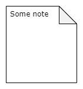
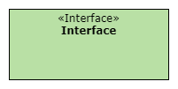
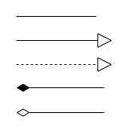
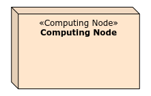

<!-- markdownlint-disable-next-line blanks-around-headings -->
# Referenz: Elemente und Beziehungen des Architecture Decomposition Framework
{: .no_toc }

Version 1.1.0

<!-- markdownlint-disable-next-line blanks-around-headings -->
## Inhalt <!-- omit in toc -->
{: .no_toc }

- TOC
{:toc}

## Übersicht

Hier sind alle Elemente in der Übersicht:

{: .hint-title }
> Übersetzung der Element- und Beziehungstypen
>
> Um eine Übertragbarkeit der Diagramme in verschiedene Sprachen zu ermöglichen, behalten wir die englischen Bezeichnungen für die Typen der Elemente und Beziehungen bei (Bezeichnungen innerhalb der spitzen Klammern, z.B. «External System» oder «use»). Die Namen und Beschreibungen der Elemente und Beziehungen können hingegen in der jeweiligen Landessprache verfasst werden. Beispiel:
>
> 

## Software@Runtime

Software = Daten und Funktionen, daher können diese Elemente in Ansichten der Typen Data@Runtime und Functions@Runtime verwendet werden.

| Element | Beschreibung |
| ------- | ----------- |
|  | Eine Rolle repräsentiert die Interessen einer bestimmten Gruppe von Stakeholdern. |
|  | Das zu untersuchende System auf höchster Repräsentationsebene, welche im Architekturdesign weiter zerlegt wird. |
|  | Ein externes System ist ein System, das im Kontext des zu untersuchenden Systems steht, aber nur teilweise beeinflusst werden kann. Externe Systeme stellen Kommunikationsmöglichkeiten/Schnittstellen bereit, z.B. zum Senden oder Empfangen von Daten. |
|  | Eine Schicht ist ein logischer (horizontaler) Container für Komponenten. Sie ermöglicht es, gemeinsame Zugriffsregeln für alle in der Schicht enthaltenen Komponenten zu definieren. Schichten sind typischerweise geordnet und definieren somit die Richtung und Hierarchie der Zugriffe. |
|  | Ein Cluster ist ein logischer (vertikaler) Container für Komponenten. Er ermöglicht es, gemeinsame Zugriffsregeln für alle im Cluster enthaltenen Komponenten zu definieren. |
|  | Eine Komponente ist eine funktional eigenständige Laufzeiteinheit, die ein Anliegen eines Softwaresystems bearbeitet. Eine Komponente kann aus anderen Komponenten bestehen. Komponenten bieten und benötigen Schnittstellen zur Kommunikation mit anderen Komponenten. |
|  | Schnittstellen-Connectoren können mit Systemen oder Komponenten verwendet werden. Die linke Seite ("Lollipop") bietet eine Schnittstelle, die rechte Seite benötigt eine Schnittstelle. Ein Schnittstellen-Connector zur Laufzeit kann durch ein [Schnittstellenelement zur Entwicklungszeit](#softwaredevtime) realisiert werden, das typischerweise denselben Namen verwendet. |
|  | Schnittstellenelemente werden verwendet, um klare Komponentenabgrenzungen zu definieren. Jede Schnittstelle ist auf eine bestimmte Rolle zentriert, die eine Komponente hat. Während für die meisten Anwendungsfälle das Schnittstellen-Connector-Element (siehe oben) ausreichend ist, kann dieses Schnittstellenelement spezifischere Informationen über bestimmte Schnittstellenendpunkte oder -methoden bereitstellen und kann mit mehreren Komponenten verbunden werden, um auszudrücken, dass sie dieselbe Schnittstelle bieten oder benötigen. Ein Schnittstellen-Connector zur Laufzeit kann durch ein [Schnittstellenelement zur Entwicklungszeit](#softwaredevtime) realisiert werden, das typischerweise denselben Namen verwendet. |
|  | Ein Connector ermöglicht es Komponenten, mit anderen Komponenten zu kommunizieren, die durch ihn verbunden sind. Ein Connector kann als Abstraktion komplexer Interaktionsmechanismen verwendet werden. Er kann hierarchisch aus weiteren Komponenten und Connectors bestehen, die die Kommunikation realisieren. |
|  | Um den Austausch von Informationen zur Laufzeit zwischen Komponenten, über Connectors oder in und aus dem System auszudrücken, werden Daten-Entitäten verwendet. Ihre Struktur ist meistens durch einen Datentyp (Entwicklungszeit-Element) definiert. |
|  | Eine Technologie repräsentiert die Nutzung von Drittanbieter-Lösungen, z.B. in Form einer Bibliothek oder eines Tools. |
|  | Datenfluss zeigt an, dass Daten von einem Element zum anderen fließen. |
|  | Nutzung zeigt an, dass ein Element ein anderes Element verwendet. Dadurch werden Abhängigkeiten aufgezeigt. |
|  | Kann um mehrere Systeme oder Komponenten gezeichnet werden, um anzuzeigen, dass diese den Systemumfang bilden (im Gegensatz zu allem anderen, das den Systemkontext bildet). |
|  | Notizelemente werden verwendet, um weitere Informationen oder Erklärungen in einem Diagramm zu geben. |
|  | Verbindet Notizelemente mit bestimmten Diagrammelementen oder -beziehungen, um sie zu annotieren. |

## Software@Devtime

Software = Daten und Funktionen, daher können diese Elemente in Ansichten der Typen Data@Devtime und Functions@Devtime verwendet werden.

| Element | Beschreibung |
| ------- | ----------- |
|  | Ein Modul ist eine Entwicklungszeiteinheit, die mit Hilfe von Entwicklungstools erstellt wird und eine oder mehrere Komponenten realisiert. |
|  | Schnittstellen werden verwendet, um klare Modulgrenzen zu definieren. Sie können verwendet werden, um von Modulen zu abstrahieren, die eine gemeinsame Funktionalität mit unterschiedlichen Implementierungen bieten, oder um einen [Schnittstellen-Connector oder ein Schnittstellenelement zur Laufzeit](#softwareruntime) zu realisieren, das dann typischerweise denselben Namen verwendet. |
|  | Ein Paket ist ein physischer Container für Module und hilft, sie zu organisieren. |
|  | Ein Datentyp definiert, wie Daten-Entitäten eines bestimmten Typs strukturiert sind, welche Attribute sie enthalten und wie sie miteinander in Beziehung stehen. |
|  | Eine Bibliothek ermöglicht es einem System, eine spezifische Technologie zu nutzen, die in einer Bibliothek verpackt ist. |
|  | Eine Technologie repräsentiert die Nutzung von Drittanbieter-Lösungen, z.B. in Form einer Bibliothek oder eines Tools. |
|  | Refinement (Verfeinerung) ist eine Beziehung, die eine genauere Spezifikation von etwas darstellt, das bereits auf einer bestimmten Detailebene spezifiziert wurde. Zum Beispiel ist eine Designklasse eine Verfeinerung einer Analyseklasse. |
|  | Nutzung (Usage) zeigt an, dass ein Element ein anderes Element für die vollständige Implementierung oder den Betrieb benötigt, z.B. die Nutzung einer Technologie oder einer Bibliothek. |
|  | Assoziation, Generalisierung, Realisierung, Komposition und Aggregation werden wie in UML-Klassendiagrammen verwendet (siehe Standardliteratur zu diesem Thema). |
|  | Notizelemente werden verwendet, um weitere Informationen oder Erklärungen in einem Diagramm zu geben. |
|  | Verbindet Notizelemente mit bestimmten Diagrammelementen oder -beziehungen, um sie zu annotieren. |

## Environment@Runtime

Umgebung (Environment) = Bereitstellung und Aktivitäten, daher können diese Elemente in Ansichten der Typen Deployment@Runtime und Activities@Runtime verwendet werden.

| Element | Beschreibung |
| ------- | ----------- |
|  | Ein Computing Node ("Rechenknoten") repräsentiert eine (virtuelle oder reale) Maschine (oder Server). Dieser Knoten wird verwendet, um ein Deployment-Artefakt oder eine Ausführungsumgebung auszuführen. |
|  | Eine Ausführungsumgebung läuft auf einem Computing Node und ist in der Lage, ein Deployment-Artefakt auszuführen. Z.B. Browser, Anwendungsserver, Docker. |
|  | Ein Deployment-Artefakt ist eine Einheit zur Entwicklungs- und Betriebszeit, die auf einem Computing Node oder einer Ausführungsumgebung bereitgestellt ("deployt") werden kann. |
|  | Der Betriebsprozess beschreibt, wie spezifische Rollen Rechenknoten und Ausführungsumgebungen betreiben, um Deployment-Artefakte auszuführen. |
|  | Eine Technologie repräsentiert die Nutzung von Drittanbieter-Lösungen, z.B. in Form einer Bibliothek oder eines Tools. |
|  | Neben dem reinen Verhalten von Komponenten in Form von Nachrichtenaustausch können auch Aspekte der Parallelität wichtig sein. Mit Threads kann parallele Ausführung ausgedrückt werden, und man kann die Kommunikation zwischen Threads und den zugewiesenen Komponenten skizzieren. |
|  | Eine Rolle repräsentiert die Interessen einer bestimmten Gruppe von Stakeholdern. |
|  | Eine Organisationseinheit spiegelt die Organisationsstruktur der beteiligten Parteien wider. Sie hilft, Rollen zu strukturieren. |
|  | Betrieb (Operation): Rechenknoten und Ausführungsumgebungen werden von Rollen oder Betriebsprozessen betrieben. |
|  | Ausführung (Execution): Ausführungsumgebungen führen Komponenten (aus Software@Runtime-Ansichten) aus. |
|  | Bereitstellung (Deployment): Deployment-Artefakte werden auf Rechenknoten oder Ausführungsumgebungen bereitgestellt. |
|  | Besitz (Ownership): Rollen können Rechenknoten und Betriebsprozesse besitzen. |
|  | Manifestation: Deployment-Artefakte manifestieren Komponenten (aus Software@Runtime). |
|  | Ein Kommunikationspfad kann verwendet werden, um Kommunikation zwischen Rechenknoten zu modellieren. |
|  | Notizelemente werden verwendet, um weitere Informationen oder Erklärungen in einem Diagramm zu geben. |
|  | Verbindet Notizelemente mit bestimmten Diagrammelementen oder -beziehungen, um sie zu annotieren. |

Weitere benutzerdefinierte Beziehungen sind möglich (siehe Abschnitt "Benutzerdefinierte Elemente und Beziehungen"), z.B.

- eine Rolle *gehört zu* (*belongs to*) einer Organisationseinheit, oder
- eine Rolle *folgt* (*follows*) einem Betriebsprozess.

## Environment@Devtime

Umgebung (Environment) = Bereitstellung und Aktivitäten, daher können diese Elemente in Ansichten der Typen Deployment@Runtime und Activities@Runtime verwendet werden.

| Element | Beschreibung |
| ------- | ----------- |
|  | Eine Rolle repräsentiert die Interessen einer bestimmten Gruppe von Stakeholdern. |
|  | Eine Organisationseinheit spiegelt die Organisationsstruktur der beteiligten Parteien wider. Sie hilft, Rollen zu strukturieren. |
|  | Ein Projektinkrement stellt den Fortschritt bei der Umsetzung des Projekts dar und realisiert Teile des Systems oder das endgültige System in Form von Modulen. |
|  | Ein Deployment-Artefakt ist eine Einheit zur Entwicklungs- und Betriebszeit, die auf einem Computing Node oder einer Ausführungsumgebung bereitgestellt ("deployt") werden kann. |
|  | Der Entwicklungsprozess beschreibt, wie spezifische Rollen zusammenarbeiten, um ein Projektinkrement zu entwickeln. |
|  | Ein Entwicklungstool wird während des Entwicklungsprozesses verwendet, um Module als Artefakt zu erstellen, das einer bestimmten Technologie entspricht. |
|  | Eine Technologie repräsentiert die Nutzung von Drittanbieter-Lösungen, z.B. in Form einer Bibliothek oder eines Tools. |
|  | Manifestation: Deployment-Artefakte manifestieren Module (aus Software@Devtime). |
|  | Nutzung (Usage): Rollen können Entwicklungstools verwenden. |
|  | Besitz (Ownership): Rollen können Entwicklungsprozesse besitzen. |
|  | Notizelemente werden verwendet, um weitere Informationen oder Erklärungen in einem Diagramm zu geben. |
|  | Verbindet Notizelemente mit bestimmten Diagrammelementen oder -beziehungen, um sie zu annotieren. |

Weitere benutzerdefinierte Beziehungen sind möglich (siehe Abschnitt "Benutzerdefinierte Elemente und Beziehungen"), z.B.

- ein Entwicklungsprozess *erstellt* (*creates*) ein Projektinkrement, oder
- eine Rolle *gehört zu* (*belongs to*) einer Organisationseinheit.

## Benutzerdefinierte Elemente und Beziehungen

Wir können jederzeit eigene, benutzerdefinierte Elemente erstellen, wenn die vordefinierten Elemente nicht ausreichen, um die Architektur zu erklären.

| Element | Beschreibung |
| ------- | ----------- |
|  | Beispiel für ein benutzerdefiniertes Element *Domäne* (*Domain*). Verwendet das Cluster-Element, aber als eigenen Typ Domäne. Die Bedeutung des Elements muss im Kontext der Architekturdokumentation definiert werden. |
|  | Beispiel für eine benutzerdefinierte Beziehung *initiiert* (*initiates*). Die Bedeutung dieser Beziehung muss im Kontext der Architekturdokumentation definiert werden. |
