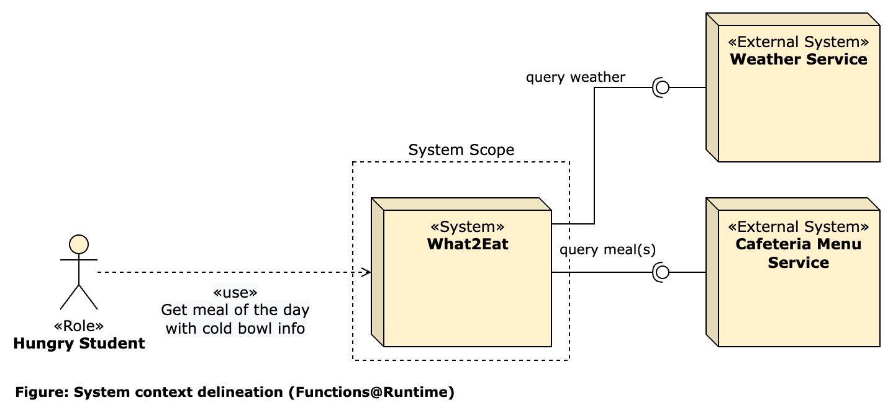
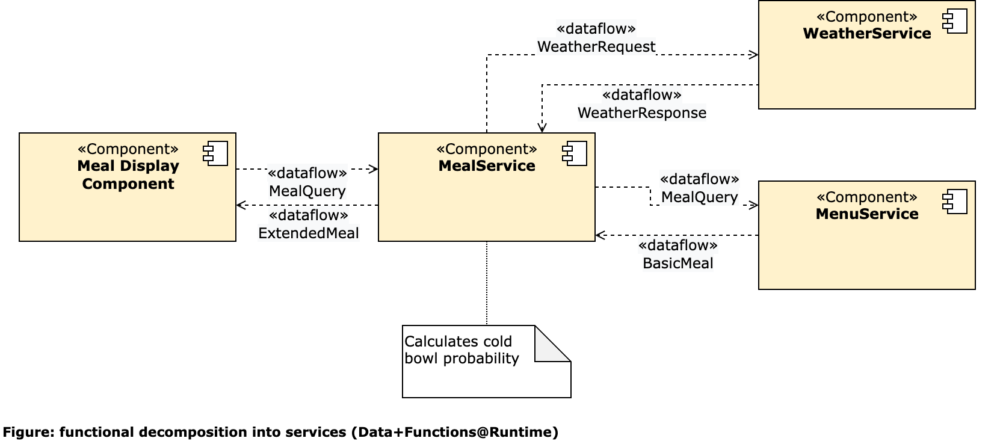
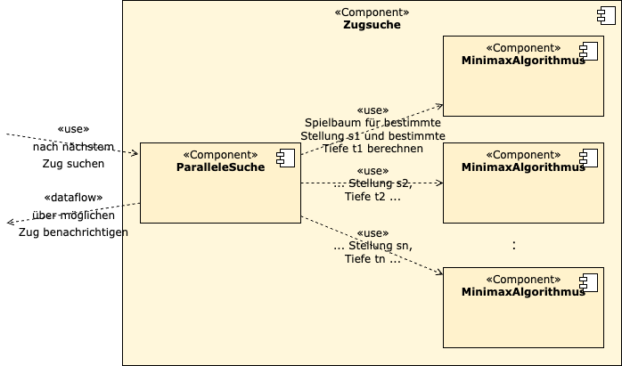
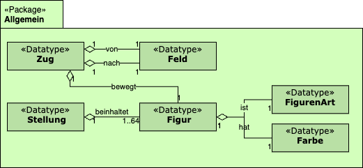
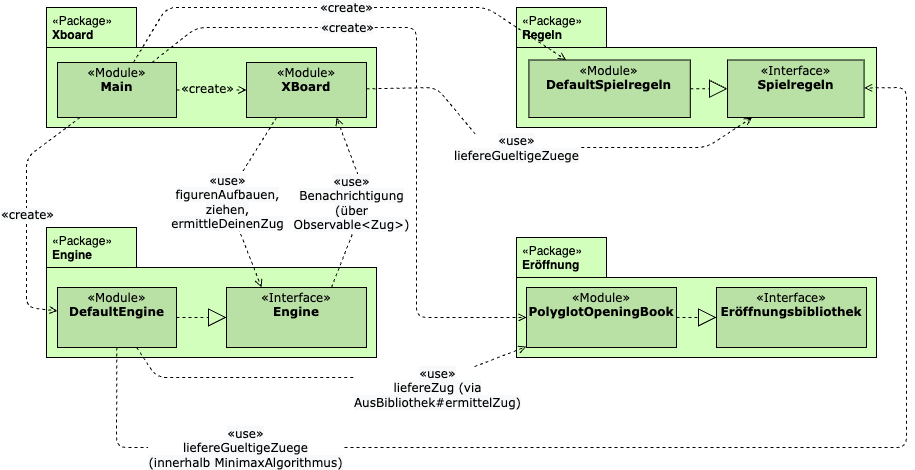
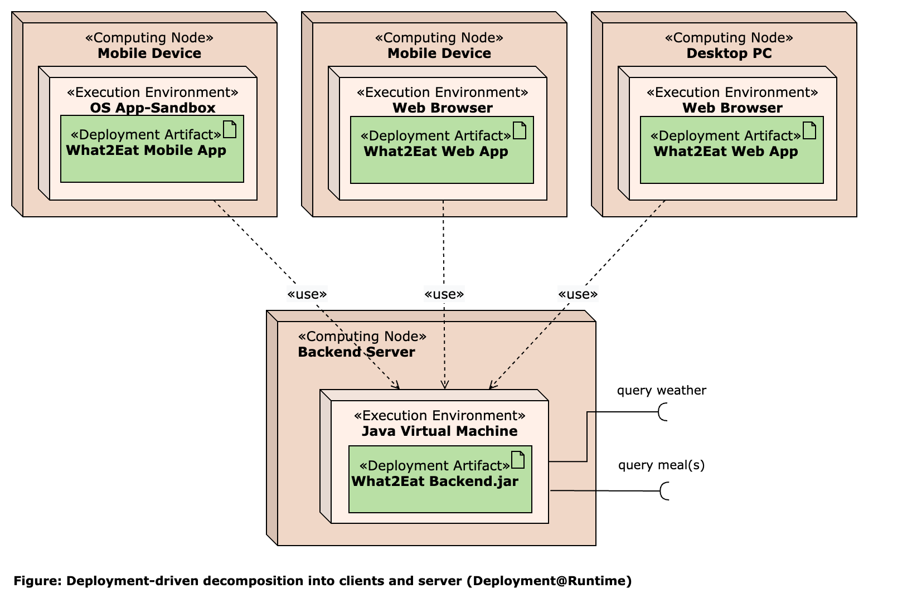
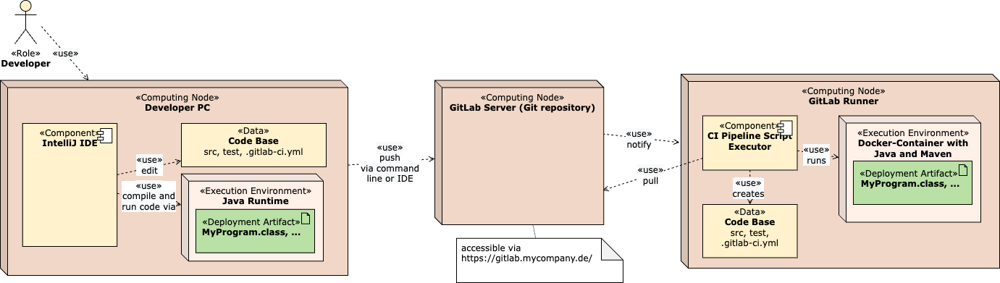

<!-- markdownlint-disable-next-line blanks-around-headings -->
# Beispiele für ADF-Sichten
{: .no_toc }

Diese Sichten sind den [Beispiel-Dokumentationen](../documentation/examples.html) entnommen. Weitere Beispiele finden sich dort.

Die Beschriftung folgt dem Schema "Name der Sicht (Typ der Sicht)".

<!-- markdownlint-disable-next-line blanks-around-headings -->
## Inhalt
{: .no_toc }

- TOC
{:toc}

## What2Eat: System-Kontext-Diagramm (Functions@Runtime)

## What2Eat: Technologieauswahl für die Systeme (Technology@Runtime)

## What2Eat: Zerlegung in Services (Data+Functions@Runtime)

## DokChess: Zugsuche-Komponente (Functions@Runtime)

## DokChess: Wichtige Datentypen (Data@Devtime)

## DokChess: Code-Struktur (Functions@Devtime)

## What2Eat: Deployment-getriebene Zerlegung (Deployment@Runtime)

## GitLab-CI: Build-Prozess Backend (Deployment+Activities@Devtime)

## Digitale Dörfer: viele weitere Beispiele

Das ADF lässt sich auch auf dem Whiteboard einsetzen. Weitere Beispiele aus dem Projekt "Digitale Dörfer" finden sich in diesem [Blog-Artikel](https://www.iese.fraunhofer.de/blog/softwarearchitekturen-einfacher-designen-und-verstaendlicher-dokumentieren-mit-dem-fraunhofer-adf/#Beispiele).
