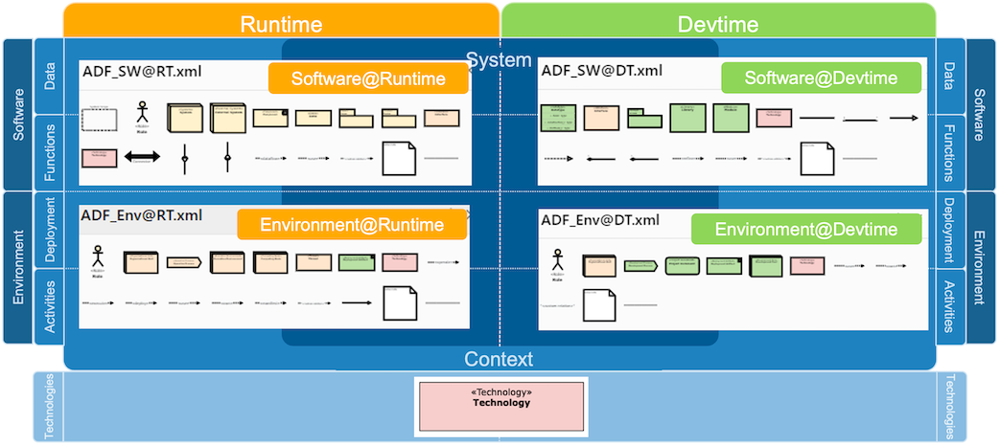
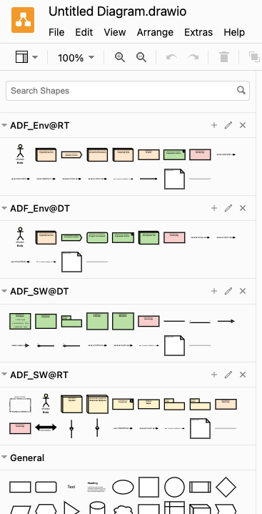

# ADF-Elemente für Diagrams.net

[Diagrams.net (ehemals draw.io)](https://www.diagrams.net/) ist ein beliebtes Open-Source-Diagrammwerkzeug, das im Browser oder als Desktop-Anwendung verwendet werden kann.
Wir stellen eine Reihe von ADF-Elementen für Diagrams.net zur Verfügung, die verwendet werden können, um Architekturdiagramme im ADF-Stil zu erstellen. Die Elemente sind in Elemente-Paletten für verschiedene Sichten-Typen organisiert:



Element-Paletten heißen in Diagrams.net "Bibliotheken". Um unsere ADF-Bibliotheken für Diagrams.net zu verwenden, gehen wir zum [ADF-Diagrams.net Repository](https://github.com/architecture-decomposition-framework/adf-diagramsnet), laden die vier XML-Dateien aus dem Verzeichnis "library" herunter und importieren sie in Diagrams.net über "Datei -> Bibliothek öffnen...". Alternativ können wir [über diesen Link](https://app.diagrams.net/?splash=0&libs=general&clibs=Uhttps%3A%2F%2Fraw.githubusercontent.com%2Farchitecture-decomposition-framework%2Fadf-diagramsnet%2Fmain%2Flibraries%2FADF_SW%40RT.xml;Uhttps%3A%2F%2Fraw.githubusercontent.com%2Farchitecture-decomposition-framework%2Fadf-diagramsnet%2Fmain%2Flibraries%2FADF_Env%40RT.xml;Uhttps%3A%2F%2Fraw.githubusercontent.com%2Farchitecture-decomposition-framework%2Fadf-diagramsnet%2Fmain%2Flibraries%2FADF_SW%40DT.xml;Uhttps%3A%2F%2Fraw.githubusercontent.com%2Farchitecture-decomposition-framework%2Fadf-diagramsnet%2Fmain%2Flibraries%2FADF_Env%40DT.xml) Diagrams.net im Browser starten, wo bereits alle ADF-Bibliotheken eingebunden sind.

.

## Documentation-as-code, Diagrams.net-Abbildungen in Markdown einbetten

{: .highlight }
Diagrams.net passt sehr gut zum Documentation-as-code-Workflow, da es den Diagramm-Code in eine SVG- oder PNG-Dateien einbetten kann. So können wir die SVG- (oder PNG-) Datei öffnen, das Diagramm bearbeiten und sowohl die SVG- (oder PNG-) Datei als auch das eingebettete Diagramm werden beim Speichern aktualisiert. Dadurch ist kein zusätzlicher Konvertierungs- oder Exportierungsschritt nötig, sondern wir können die SVG- (oder PNG-) Datei direkt in die Markdown-Datei einbetten.

Da es gute Diagrams.net-Integration für verschiedene IDEs gibt, brauchen wir diese zum Bearbeiten der Diagramme nicht zu verlassen und können Dokumentationstext und -abbildungen direkt bearbeiten.

Weiter unten ist beschrieben, wie man die Diagrams.net-Integration installiert und konfiguriert. Einmal eingerichtet, können wir eine neue Datei `diagram.drawio.png` (oder `diagram.drawio.svg`) erstellen, sie mit dem diagrams.net-Plugin in unserer IDE öffnen und unser Diagramm zeichnen und speichern. In unserer Markdown-Datei können wir das Diagramm dann mit folgendem Code einbetten:

```markdown

```

Alle Diagramme in [dieser Beispieldokumentation](https://github.com/neshanjo/what2eat/blob/with-cache/doc/architecture-documentation.md) sind auf diese Weise erstellt und eingebettet (siehe [Quellcode](https://raw.githubusercontent.com/neshanjo/what2eat/refs/heads/with-cache/doc/architecture-documentation.md)).

### Installation

Diagrams.net läuft ohne Installation in jedem Webbrowser und kann als Desktop-Anwendung installiert werden. Wir empfehlen jedoch, eines der (inoffiziellen, aber ausgezeichneten) IDE-Plugins zu verwenden, um die Diagramme bearbeiten zu können, ohne die IDE zu verlassen.

 [Visual Studio Code](https://code.visualstudio.com/) ist hervorragend für die Bearbeitung von Markdown geeignet, da es einige sehr gute Plugins gibt, die die Erstellung der Dokumentation unterstützen:

- [Markdown All in One](https://marketplace.visualstudio.com/items?itemName=yzhang.markdown-all-in-one) ermöglicht es, Überschriftennummerierung und Inhaltsverzeichnisse automatisch zu generieren; beides Funktionen, die Markdown leider nicht selbst unterstützt.
- [markdownlint](https://marketplace.visualstudio.com/items?itemName=DavidAnson.vscode-markdownlint) stellt sicher, dass sich der Markdown-Code an bestimmte Regeln hält (wie Leerzeilen vor und nach Überschriften usw.).
- [Draw.io integration](https://marketplace.visualstudio.com/items?itemName=hediet.vscode-drawio) ermöglicht es, unsere Diagramme direkt in der IDE zu bearbeiten. Um ein neues zu erstellen, erstellen wir einfach eine neue Datei *name*.drawio.svg (oder *name*.drawio.png) und öffnen sie mit dem Plugin. Dann wird bei jedem Speichern die SVG- (oder PNG-)Datei zusammen mit dem Diagramm aktualisiert.
- [Code Spell Checker](https://marketplace.visualstudio.com/items?itemName=streetsidesoftware.code-spell-checker) hilft mit einer Rechtschreibprüfung(optional können wir auch Unterstützung für andere Sprachen installieren).

{: .hint-title }
> IntelliJ
>
> Es gibt auch ein [Diagrams.net-Plugin für IntelliJ IDEA](https://plugins.jetbrains.com/plugin/15635-diagrams-net-integration). Es unterstützt jedoch keine benutzerdefinierten Bibliotheken. Als Workaround können wir [diese Datei](https://github.com/architecture-decomposition-framework/adf-diagramsnet/blob/main/source/ADF.drawio) herunterladen, in IntelliJ öffnen und die benötigten Elemente kopieren und einfügen.
>
> Es empfiehlt sich, auch [weichen Zeilenumbruch für Markdown-Dateien](assets/intellij-markdown-softwrap.png) in IntelliJ einzustellen und [einige nützliche Einstellungen für den Markdown-Editor](pages/views/tooling/assets/intellij-markdown-editor-settings.png) vorzunehmen.

### ADF-Werkzeugbibliotheken konfigurieren

Um die [ADF-Bibliotheken für diagrams.net](https://github.com/architecture-decomposition-framework/adf-diagramsnet) mit dem VS Code-Plugin zu verwenden, müssen wir die XML-Datei aus dem Verzeichnis *libraries* auf unseren Computer herunterladen und dann in den VS Code-Einstellungen.json konfigurieren:

```json
  "hediet.vscode-drawio.customLibraries": [
    {
      "file": "c:\\Misc\\adf-diagramsnet\\libraries\\ADF_SW@RT.xml",
      "libName": "ADF SW@RT"
    },
    {
      "file": "c:\\Misc\\adf-diagramsnet\\libraries\\ADF_Env@RT.xml",
      "libName": "ADF Env@RT"
    },
    {
      "file": "c:\\Misc\\adf-diagramsnet\\libraries\\ADF_SW@DT.xml",
      "libName": "ADF SW@DT"
    },
    {
      "file": "c:\\Misc\\adf-diagramsnet\\libraries\\ADF_Env@DT.xml",
      "libName": "ADF Env@DT"
    }
  ]
```

In der Beispielkonfiguration handelt es sich um einen Windows-Rechner. Wir müssen natürlich die Pfade entsprechend anpassen.

Aufgepasst: Wenn nur eine der Dateien nicht existiert oder die Konfiguration einen Fehler enthält, startet bleibt die Diagrams.net-Ansicht weiß (ohne Fehlermeldung). **Also am besten doppelt überprüfen!**

{: .hint-title }
> Wichtig
>
> Das Diagrams.net-Plugin hat eine **Besonderheit**: Es zeigt die ADF-Paletten erst an, wenn wir einmal auf die Schaltfläche ["Weitere Formen"](assets/more_shapes.png) und dann auf "Anwenden" im geöffneten Dialog klicken. Danach werden die ADF-Paletten angezeigt.

### Arbeiten im Dark-Mode

Entwickler:innen verwenden gerne ein Dark-Theme für ihre IDE. Diese Einstellung wird auch vom Diagrams.net-Plugin in VS Code berücksichtigt. Allerdings werden dann die Diagramme anders gerendert (dunkel), was meist nicht zur Ansicht auf auf dem Git-Server (im hellen Modus) passt.

Der empfohlene Ansatz ist, ein helles Theme nur für das Diagrams.net-Plugin zu verwenden, indem wir

```json
  "hediet.vscode-drawio.theme": "Kennedy",
```

in den Einstellungen.json von VS Code konfigurieren.

Außerdem können Diagramme mit transparentem Hintergrund im Dark-Mode unlesbar aussehen. Daher stellen wir sicher, dass in jedem Diagramm der Hintergrund auf Weiß gesetzt ist, wie in [diesem Screenshot](assets/digramsnet_darkmode_fix.png) demonstriert.
