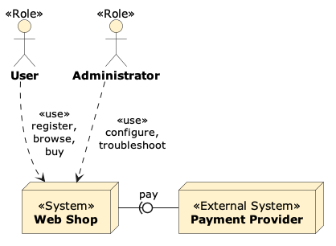

# diagrams-as-code mit PlantUML

Mit [PlantUML](https://plantuml.com/) können wir Diagramme als Code schreiben. Trotz seines Namens unterstützt PlantUML nicht nur UML, sondern auch eine Vielzahl anderer Diagrammtypen und kann mit eigenen Elementen angepasst werden.

Diagrams-as-code hat mehrere Vorteile:

- **Versionskontrolle**: Diagramme werden als Textdateien gespeichert, die mit Git oder einem anderen Versionskontrollsystem versioniert werden können. Anhand des Diffs kann man direkt sehen, was sich in einem Diagramm geändert hat.
- **Fokus auf die Modellierung**: Der Fokus liegt auf dem Inhalt (Elemente und deren Beziehungen), nicht auf dem Layout. PlantUML ordnet die Elemente im Diagramm automatisch an, was viel Zeit sparen kann.
- **Dokumentation-as-code**: Diagramme können direkt in die Dokumentation eingebettet werden, was besonders praktisch ist, wenn man einen Dokumentation-as-code-Workflow verwendet.

Zwei Dinge sind zu beachten: Die anfängliche Lernkurve ist etwas steiler als bei GUI-basierten Tools, und das automatische Layout funktioniert nicht immer zufriedenstellend, insbesondere bei größeren Diagrammen.

## ADF-Elemente für PlantUML

Wir haben alle Elemente des ADF in PlantUML definiert, sodass wir sie in unseren Diagrammen verwenden können.

[ADF-PlantUML Repository](https://github.com/architecture-decomposition-framework/adf-plantuml){: .btn }

Hier ist ein Beispiel-Diagramm (System-Kontext-Diagramm mit ADF-Elementen), erstellt mit PlantUML:



Der Code für dieses Diagramm sieht so aus:

```plantuml-code
@startuml example1
!include https://raw.githubusercontent.com/architecture-decomposition-framework/adf-plantuml/refs/heads/main/ADF.puml

ADFRole(user, "Benutzer")
ADFRole(admin, "Administrator")

ADFSystem(ws, "Webshop")
ADFExternalSystem(pp, "Zahlungsanbieter")

ADFRelation(admin, ws, "nutzt", "konfigurieren,\ntroubleshooten")
ADFRelation(user, ws, "nutzt", "registrieren,\nbrowsen,\nkaufen")

pp -left0)- ws : "bezahlen"
@enduml
```

Wir können diesen Code im [PlantUML Online-Editor](https://www.plantuml.com/plantuml/uml/NP0zZjim48LxdK9HPGEMcRIkx2390PmYG91c93r9XAaXCHn2Za-_fDVQOYiE-Ctx8SzHIJGjhiQTbk3mhVfYkNTfG3shXdWoHcWzJbRdrAK8wJqhM8-zNmn9Frj5hqdG3iXNmKUhrdCx2YrOlTmC3MCR7759CO8ncXaqHBEGPNFvyUiOCgYgF5szmwva7EhcEpZf0zBiFmWDY-MCBkMqKONK5ruMVl-FYcMtnip_e8kp3-_AdtU5CBdNGWXvuI_DBl4KYJiBnUPnXQFIVGjwcfKMskJXvdcqKn8B0H_-iOfFdKDEyWf-rTmSoYC-6mYcKdhJT-BN-9nkb4PmAH52tJgC-dNVPd5zgfiE3vfTfjKPF9IFUWC0) öffnen und testen. Für einen Offline-Workflow laden wir die ADF.puml-Datei aus dem [ADF-PlantUML Repository](https://github.com/architecture-decomposition-framework/adf-plantuml) herunter, legen sie in dasselbe Verzeichnis wie unsere PlantUML-Datei und binden sie mit `!include ADF.puml` ein.

## PlantUML und Markdown - Dokumentation-as-code

Es gibt im Wesentlichen zwei Möglichkeiten, PlantUML-Diagramme in die Markdown-Dokumentation einzubinden:

1. **Separate .puml-Datei**: Wir können den PlantUML-Code in einer separaten Datei mit der Erweiterung `.puml` schreiben (z.B. `diagram.puml`), manuell in ein Bild konvertieren (z.B. `diagram.png`) und in die Markdown-Datei einbinden (mit ``). Dies ist empfehlenswert, wenn wir den Diagramm-Quellcode von unserem Dokumentations-Quellcode trennen möchten. Der Konvertierungsschritt kann auch über die Befehlszeile oder innerhalb einer CI/CD-Pipeline automatisiert werden (im Wesentlichen durch Aufrufen von `plantuml *.puml` im Verzeichnis mit den `puml`-Dateien).

2. **PlantUML-Code einbetten**: Wir können den PlantUML-Code direkt in die Markdown-Datei einbetten, indem wir `plantuml`-Codeblöcke verwenden. Ein Beispiel finden wir im [Quellcode](assets/embedded-plantuml.txt). Dies ist empfehlenswert, wenn wir den Diagramm-Quellcode zusammen mit unserer Dokumentation in einem Dokument pflegen wollen. Zu beachte ist, dass die aktuelle GitHub-Version das Rendern von PlantUML-Codeblöcken beim Verarbeiten von Markdown-Dateien nicht unterstützt, sodass wir diesen Schritt zur CI/CD-Pipeline hinzufügen müssen. Das Skript [replace_plantuml.py](assets/replace_plantuml.py) kann dabei hilfreich sein (Code prüfen, Verwendung auf eigenes Risiko).

## Arbeiten mit PlantUML in VS Code

Zuerst müssen wir die [VS Code PlantUML-Erweiterung](https://marketplace.visualstudio.com/items?itemName=jebbs.plantuml) installieren. Nun ist eine Vorschau für alle `puml`-Dateien verfügbar. Um das Rendern von eingebetteten PlantUML-Codeblöcken in Markdown-Dateien zu aktivieren:

- die VS Code-Einstellungen öffnen
- nach "plantuml" suchen
  - "Plantuml: Render" auf "Server" einstellen
  - "Plantuml: Server" auf den Pfad des offiziellen Servers (<https://www.plantuml.com/plantuml>) setzen
  - Hinweis: Alle Diagramme werden nun an den Server gesendet! In gewissen Fällen ist das nicht geeignet. Für vertrauliche Projekte oder wenn wir offline arbeiten möchten, können wir das PlantUML-Kommandozeilen-Tool installieren (`brew install plantuml` auf MacOS), den Server auf "Lokal" setzen, den Befehl `plantuml -picoweb` in einem Terminal ausführen (startet einen lokalen Server) und den Serverpfad auf `http://localhost:8080` setzen.

Um die ADF-Elemente zu verwenden, können wir einfach `!include https://raw.githubusercontent.com/architecture-decomposition-framework/adf-plantuml/refs/heads/main/ADF.puml` in unsere PlantUML-Datei/Code einfügen.

Damit `!include ADF.puml` für eine lokale Kopie der ADF.puml-Datei funktioniert, müssen wir das PlantUML-Plugin so konfigurieren, dass es die Datei im richtigen Verzeichnis sucht:

- "View -> Command Palette" wählen, dann "> User Preferences (JSON)" eingeben und auswählen.
- dort Folgendes hinzufügen:

    ```json
    "plantuml.includepaths": [
        "/pfad/zum/verzeichnis/mit/datei/"
    ],
    ```

    Den Pfad auf das Verzeichnis anpassen, in dem sich die ADF.puml-Datei befindet.

## Dokumentationswebseite mit PlantUML-Diagrammen generieren

Mehrere Site-Generatoren können eine vollständige Dokumentationsseite aus Markdown-Code erzeugen und unterstützen auch die PlantUML-Konvertierung. Siehe [mkdocs-with-plantuml](https://github.com/neshanjo/mkdocs-with-plantuml) für ein Beispiel, das MkDocs mit der `plantuml_markdown`-Erweiterung und dem `build_plantuml`-Plugin konfiguriert.

Es gibt auch Unterstützung für PlantUML in Jekyll, siehe z.B. das Drittanbieter-Plugin [jekyll-plantuml](https://github.com/RichDom2185/jekyll-plantuml) (dieses Plugin wurde vom Autor dieser Dokumentation nicht getestet).
